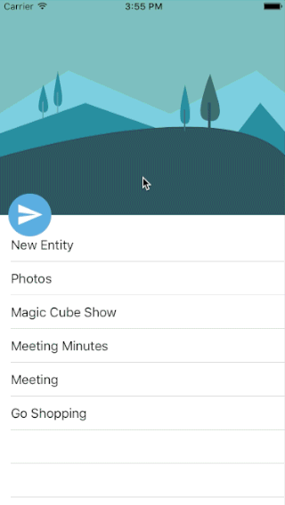

# FlyRefresh
A simple iOS implementation of [Replace](https://dribbble.com/shots/2067564-Replace), designed by [Zee Youn](https://dribbble.com/zeeyoung).

Inspired by [FlyRefresh by race604](https://github.com/race604/FlyRefresh).

It's just a rough implementation, just for fun.
There are many functions need to be implemented.

# Screenshot


# Features
> 1. Separate flight journey into two parts depends on the network
> 2. There is a default loading animation (change the color of the sky simply)
> 3. There is a default particle animation when refresh is finished to indicate the loading is done, you can replace it with your own implemetation.

# How to use
1. Add refresh view:

```
    FlyHeaderView *flyHeaderView = [[FlyHeaderView alloc] initWithTableViewAndHeaderHeight:300];
    flyHeaderView.delegate = self;
    flyHeaderView.tableView.delegate = self;
    flyHeaderView.tableView.dataSource = self;
    [self.view addSubview:flyHeaderView];
    self.flyHeaderView = flyHeaderView;
```

2. Conform to protocol

```
#pragma mark - FlyRefreshViewDelegate
- (void)requestDataWithFlyHeaderView:(FlyHeaderView *)flyHeaderView {
    dispatch_after(dispatch_time(DISPATCH_TIME_NOW, (int64_t)(5 * NSEC_PER_SEC)),
       dispatch_get_main_queue(), ^{
           [self didReceivedData];
       });
}

- (void)didReceivedData {
    [self.tableData insertObject:[[CellDataEntity alloc] initWithTitle:@"New Entity" andIcon:@"icon2" andPublishDate:@"Sep 25, 2015"] atIndex:0];
    
    /**
     *  you must invoke this method once received data from server,
     *  otherwise, the flight will never come back
     */
    [self.flyHeaderView sendFlightBack];
}

- (void)didFinishedRefreshWithFlyHeaderView:(FlyHeaderView *)flyHeaderView {
    [self.flyHeaderView.tableView insertRowsAtIndexPaths:@[[NSIndexPath indexPathForRow:0 inSection:0]] withRowAnimation:UITableViewRowAnimationFade];
    [self.flyHeaderView showFeedbackHintWithStatus:FLIGHT_STATUS_SUCCESS];
}
```